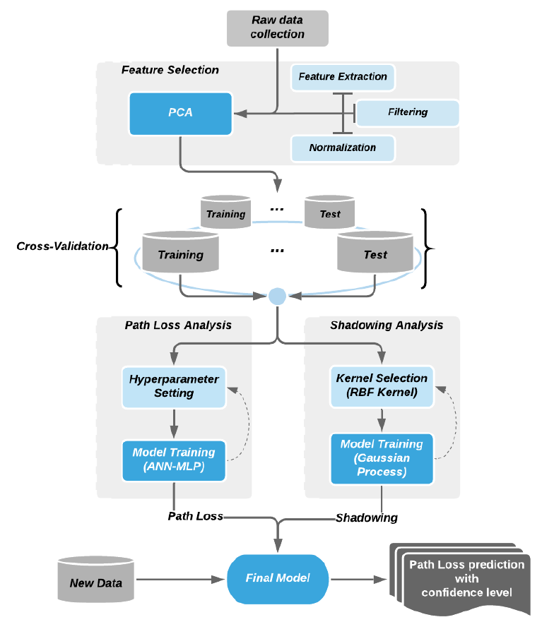

# Path Loss Prediction Based on Machine Learning Techniques: Principal Component Analysis, Artificial Neural Network, and Gaussian Process

---

## 研究背景與動機
- Path loss預測在行動網路的規劃中至關重要，如 Link budget、Coverage 以及基地台的位置
- Path loss預測模型可以分為:
    * 經驗模型 (Empirical model) : 基於統計資料建立而成
    * 確定性模型 (Deterministic model): 仰賴已知理論或數學模型
    * 半確定性模型 (Semi-deterministic model): 結合理論基礎與隨機性
- Log-distance 加上 Shadowing 被用作大多數經驗模型的 Baseline model，不過在部分情境裡表現不佳
- 機器學習被認為能夠更好的對 Path loss 建模，但以前的方法沒有好好處理和 Path loss 相關的各種特徵


## 研究目的

- 開發基於機器學習技術的 Path loss 預測的新方法
- 結合主成分分析 (Principal components analysis, PCA)、多層感知機 (Multilayer perceptron, MLP)和Gaussian process等技術來提升 Path loss 預測準確度

*補充: PCA 簡單來說就是用線性轉換來降維*


## 提出方法

- step1. 使用 PCA 進行特徵選擇和降維
- step2. 使用 MLP 建立訓練 Path loss 預測模型
- step3. 使用 Gaussian process 建立 Shadowing 預測模型
- step4. 將 MLP 和 Gaussian process 結合，建立最後的 Path loss 預測模型

*補充: 透過 PCA 發現 Log distance 和 Log frequency 決定了超過70%的 Path loss variation*



## 資料收集

- 在韓國農村地區進行實地測量
- 頻率:450MHz、1450MHz、2300MHz
- 發射天線高度15m,接收天線高度2m
- 測量距離範圍約3.5km

## 結果分析
- 使用四個特徵(發射天線高度、接收天線高度、發射/接收天線高度比、距離)作為模型輸入以及先經過 PCA 降維後(剩下一個變數輸入)的模型比較
    * 兩者準確度相近( PCA 數值的變動比較平滑，但其實 PCA 後的準度有變差一點)
    * 有 PCA 的模型在 MLP 以及 Gaussian process的訓練時間分別只要10%和1%
- 比較四個模型: MLP、Linear model、Two-ray model、Gaussian process，結果發現MLP > GP $\approx$ Linear model > Two-ray model
- 比較 Linear Model + Original shadowing 和 Proposed Model (MLP + GP-Based shadowing)
    * Original shadowing 是基於高斯分布假設而成
    * GP-Based 方法是用於相關性分析的數學模型
    * GP-Based在 $1\sigma$、$2\sigma$、$3\sigma$ 覆蓋率的表現比 Original 更接近高斯分布 *($\sigma$:標準差)*
    => 所以 GP-Based 比較準


## 結論

- 提出的機器學習方法可以更準確地預測特定場地的路徑損耗
- 新方法在預測覆蓋率誤差小於1.6%,而傳統模型誤差可達12%
- 該方法有利於高可靠性Wireless sensor network的設計

## 未來研究方向

- 探索不同ANN結構的影響
- 開發可預測任意距離的 Path loss 預測模型
- 考慮天線高度、建築物高度等其他變數

---
### Cite

**Plain Text:**
H.-S. Jo, C. Park, E. Lee, H. K. Choi, and J. Park, "Path loss prediction based on machine learning techniques: Principal component analysis, artificial neural network, and Gaussian process", Sensors, vol. 20, no. 7, p. 1927, 2020.


**BibTeX:**
```bibtex
@article{jo2020path,
  title={Path loss prediction based on machine learning techniques: Principal component analysis, artificial neural network, and Gaussian process},
  author={Jo, Han-Shin and Park, Chanshin and Lee, Eunhyoung and Choi, Haing Kun and Park, Jaedon},
  journal={Sensors},
  volume={20},
  number={7},
  pages={1927},
  year={2020},
  publisher={MDPI}
}
```
