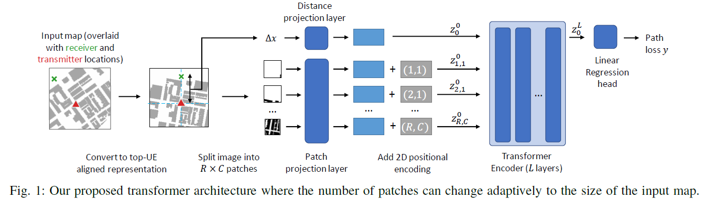

# Transformer-Based Neural Surrogate for Link-Level Path Loss Prediction from Variable-Sized Maps
## 摘要
- 提出一個基於Transformer的神經網路架構，可以從不同大小的地圖預測Link-Level Path Loss
- 該模型可以關注與路徑損耗預測相關的區域，因此能有效地擴展到不同大小的地圖
- 可以處理連續的Tx和Rx座標，不依賴離散化
- 實驗表明該模型能夠從稀疏訓練數據中有效學習Path Loss，並能很好地泛化到新的地圖
## 主要貢獻
1. 提出一個可擴展的Transformer架構，用於Link-Level Path Loss預測
2. 該模型可以處理不同大小的輸入地圖
3. 可以從稀疏數據中學習並泛化到新的場景

## 提出方法

### Scalable Transformer 架構 (基於Vit-32)
輸入: 包含Tx、Rx位置的圖像
輸出: Path loss (dB)
- 輸入圖像被分割成R x C (rows x columns)個patches
- 每個patch通過線性投影層轉換為初始潛在特徵向量
- 發射機和接收機之間的距離也被投影到潛在向量空間
- 添加位置編碼(Positional embeddings)
- 使用L個Transformer層進行特徵提取
- 最後使用線性層進行回歸預測路徑損耗


## 實驗內容
### 資料集
- 基於美國費城市中心約1.5平方公里區域的Ray-tracing模擬 (建築物資訊使用 OpenStreetMap)
- 地形資料來自U.S. Geological Survey’s gmted2010 model
- 考慮到了建築物、樹木等地理資訊(樹葉的部分是Ray-tracing模擬後再去加上樹葉的影響)
- 模擬 28GHz 毫米波傳播
- 402個Tx位置(高度: 9m)，196750個戶外Rx位置(高度: 1.5m)
- 總共 2,394,230 筆資料
- 使用 Matlab 模擬
  * 補充1: 因為計算資源和時間限制，只考慮1次反射且不考慮繞射
  * 補充2: 模擬雖然有考慮到建築物的反射特性，但地面反射是假設沒有損耗


### Baseline 模型
- UNet
- CNN(ResNet18) + MLP 
- 3GPP with LOS oracle
### 結果驗證
- 把數個不重疊區域的資料分開分別用於訓練和測試
- Train: 16%, Test: 80%, Validation: 4% 

### 結果
- 在已知地圖和新地圖上,提出的方法都優於 Baseline 模型
- 在稀疏數據上的泛化能力更強
- 可以生成密集的無線電地圖,反映建築物和植被的影響

| Algorithm               | known maps | known maps | novel maps | novel maps |
|-------------------------|------------|------------|------------|------------|
|                         | **RMSE**   | **MAE**    | **RMSE**   | **MAE**    |
| **3GPP w/ LOS oracle**   | 10.18      | 6.86       | 10.28      | 6.97       |
| **UNet**                | 8.82       | 6.72       | 9.83       | 7.77       |
| **CNN+MLP**             | 2.89       | 1.72       | 5.58       | 3.62       |
| **Scalable transformer(Ours)**   | **2.27**   | **1.15**   | **5.31**   | **3.29**   |

## 結論
- 提出的Scalable Transformer模型可以適應不同大小的地圖輸入
- 特別適用於毫米波及更短波長在城市區域的Path loss預測(因為他們的Path loss由LOS路徑主導)
- 目前模型Input只有一張2D俯視圖，未來可以加入地形訊息和建築物高度來進一步改進模型


---
### Citation

**Plain Text:**
T. M. Hehn et al., "Transformer-Based Neural Surrogate for Link-Level Path Loss Prediction from Variable-Sized Maps," GLOBECOM 2023 - 2023 IEEE Global Communications Conference, Kuala Lumpur, Malaysia, 2023, pp. 4804-4809, doi: 10.1109/GLOBECOM54140.2023.10436935.


**BibTeX:**
```bibtex
@INPROCEEDINGS{hehn2023transformer,
  author={Hehn, Thomas M. and Orekondy, Tribhuvanesh and Shental, Ori and Behboodi, Arash and Bucheli, Juan and Doshi, Akash and Namgoong, June and Yoo, Taesang and Sampath, Ashwin and Soriaga, Joseph B.},
  booktitle={GLOBECOM 2023 - 2023 IEEE Global Communications Conference}, 
  title={Transformer-Based Neural Surrogate for Link-Level Path Loss Prediction from Variable-Sized Maps}, 
  year={2023},
  volume={},
  number={},
  pages={4804-4809},
  keywords={Adaptation models;Transmitters;Buildings;Predictive models;Transformers;Propagation losses;Data models},
  doi={10.1109/GLOBECOM54140.2023.10436935}}


```